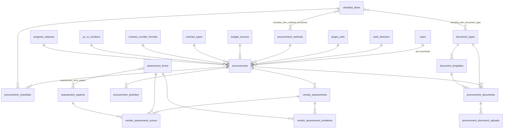

# Dokumentasi Database — Sistem Management Pengadaan UP Kendari

Dokumen ini menjelaskan seluruh struktur database aplikasi, disusun dari 37 berkas migrasi di `database/migrations`.

| | |
| --- | --- |
| Driver | MySQL |
| Nama database | `pengadaanv3` |
| Jumlah migrasi | 37 berkas |
| Jumlah tabel | 34 tabel |
| Kolom waktu | `created_at` dan `updated_at` (`timestamps()`) kecuali disebutkan lain |
| Penghapusan | `deleted_at` (`softDeletes()`) pada seluruh tabel data master dan data transaksi utama |

---

## Daftar Isi

1. [Prinsip Perancangan](#1-prinsip-perancangan)
2. [Peta Tabel](#2-peta-tabel)
3. [Tabel Bawaan Framework](#3-tabel-bawaan-framework)
4. [Autentikasi dan Pengguna](#4-autentikasi-dan-pengguna)
5. [Data Master](#5-data-master)
6. [Inti Pengadaan](#6-inti-pengadaan)
7. [Dokumen Pengadaan](#7-dokumen-pengadaan)
8. [Penilaian Kinerja Penyedia](#8-penilaian-kinerja-penyedia)
9. [Tabel Penghubung](#9-tabel-penghubung)
10. [Ringkasan Relasi](#10-ringkasan-relasi)
11. [Nilai Enum yang Disimpan sebagai String](#11-nilai-enum-yang-disimpan-sebagai-string)
12. [Aturan Penghapusan Data](#12-aturan-penghapusan-data)
13. [Riwayat Migrasi](#13-riwayat-migrasi)

---

## 1. Prinsip Perancangan

Empat aturan berikut berlaku di seluruh skema dan menjelaskan banyak keputusan bentuk tabel.

**Data master bersifat dinamis, bukan enum di kode.** Direksi pekerjaan, unit tujuan, metode pengadaan, sumber anggaran, jenis kontrak, format nomor kontrak, status progres, item checklist, jenis dokumen, dan aspek penilaian semuanya berupa tabel dengan pola yang sama: `sort_order` untuk urutan tampil, `is_active` untuk menyembunyikan pilihan dari dropdown, dan `deleted_at` untuk menonaktifkan permanen tanpa menghapus baris.

**Riwayat tidak boleh rusak.** Data master yang sudah dipakai sebuah pengadaan tidak pernah dihapus keras. Karena itu relasi dari `procurements` ke data master memakai `restrictOnDelete` atau `nullOnDelete`, tidak pernah `cascadeOnDelete`.

**Data anak ikut induknya.** Checklist, dokumen, unggahan, aktivitas, dan nilai penilaian memakai `cascadeOnDelete` terhadap induknya, karena tanpa induk baris tersebut tidak punya arti.

**Yang belum diketahui disimpan sebagai `NULL`, bukan nilai palsu.** Contohnya `level` pada `vendor_assessment_scores` bernilai `NULL` selama belum dinilai, sehingga baris kosong bisa dibedakan dari nilai rendah yang memang disengaja — dan tidak ikut menyeret rata-rata rekapitulasi.

---

## 2. Peta Tabel

Pengelompokan tabel:

| Kelompok | Tabel |
| --- | --- |
| Framework | `cache`, `cache_locks`, `jobs`, `job_batches`, `failed_jobs`, `sessions`, `password_reset_tokens`, `notifications` |
| Autentikasi | `users`, `passkeys` |
| Data master | `work_directors`, `target_units`, `procurement_methods`, `budget_sources`, `contract_types`, `contract_number_formats`, `progress_statuses`, `pr_ro_numbers`, `checklist_items`, `document_types`, `document_templates` |
| Inti pengadaan | `procurements`, `procurement_checklists`, `procurement_activities` |
| Dokumen | `procurement_documents`, `procurement_document_uploads` |
| Penilaian penyedia | `assessment_aspects`, `assessment_forms`, `vendor_assessments`, `vendor_assessment_scores`, `vendor_assessment_invitations` |
| Penghubung | `assessment_form_aspect`, `checklist_item_document_type`, `checklist_item_method_exclusions` |

---

## 3. Tabel Bawaan Framework

Delapan tabel berikut berasal dari Laravel dan tidak diubah oleh aplikasi.

### `cache` dan `cache_locks`
Penyimpanan cache berbasis database. `cache` berisi `key` (primary), `value` (mediumText), `expiration`. `cache_locks` berisi `key` (primary), `owner`, `expiration`.

### `jobs`, `job_batches`, `failed_jobs`
Antrean pekerjaan latar. `jobs` menyimpan `queue`, `payload`, `attempts`, `reserved_at`, `available_at`, `created_at`. `failed_jobs` menyimpan `uuid` unik, `connection`, `queue`, `payload`, `exception`, `failed_at`.

### `sessions`
Sesi login berbasis database. `id` (primary, string), `user_id` (index), `ip_address`, `user_agent`, `payload`, `last_activity` (index).

### `password_reset_tokens`
`email` (primary), `token`, `created_at`.

### `notifications`
Notifikasi Laravel bawaan, dipakai untuk pemberitahuan penunjukan PIC dan persetujuan perencanaan.

| Kolom | Tipe | Keterangan |
| --- | --- | --- |
| `id` | uuid, PK | |
| `type` | string | Kelas notifikasi |
| `notifiable_type`, `notifiable_id` | morphs | Selalu mengarah ke `users` |
| `data` | text | Muatan JSON |
| `read_at` | timestamp, null | Kosong berarti belum dibaca |

---

## 4. Autentikasi dan Pengguna

### `users`

Satu tabel untuk seluruh peran. Peran disimpan pada kolom `role`, bukan tabel terpisah, karena jumlahnya tetap dan melekat pada logika otorisasi.

| Kolom | Tipe | Null | Default | Keterangan |
| --- | --- | --- | --- | --- |
| `id` | bigint, PK | | | |
| `name` | string | | | |
| `email` | string, unique | | | |
| `role` | string, index | | `pic_perencana` | Lihat [daftar peran](#userrole) |
| `position` | string | ya | | Jabatan, hanya untuk tampilan |
| `is_active` | boolean | | `true` | Akun nonaktif tidak bisa ditunjuk sebagai PIC |
| `email_verified_at` | timestamp | ya | | |
| `password` | string | | | Hash |
| `two_factor_secret` | text | ya | | Rahasia TOTP terenkripsi |
| `two_factor_recovery_codes` | text | ya | | Kode pemulihan terenkripsi |
| `two_factor_confirmed_at` | timestamp | ya | | Kosong berarti 2FA belum diaktifkan |
| `remember_token` | string | ya | | |
| `deleted_at` | timestamp | ya | | Soft delete |

Indeks: `email` unik, `role`.

### `passkeys`

Kredensial WebAuthn untuk login tanpa kata sandi.

| Kolom | Tipe | Null | Keterangan |
| --- | --- | --- | --- |
| `id` | bigint, PK | | |
| `user_id` | FK → `users` | | `cascadeOnDelete`, ber-index |
| `name` | string | | Nama perangkat yang diberi pengguna |
| `credential_id` | string, unique | | |
| `credential` | json | | Kunci publik dan metadata |
| `last_used_at` | timestamp | ya | |

---

## 5. Data Master

Seluruh tabel di bagian ini memakai pola yang sama: `sort_order`, `is_active`, `timestamps`, `softDeletes`.

### `work_directors` — Direksi Pekerjaan

| Kolom | Tipe | Null | Default |
| --- | --- | --- | --- |
| `id` | bigint, PK | | |
| `name` | string | | |
| `description` | string | ya | |
| `sort_order` | uint | | `0` |
| `is_active` | boolean | | `true` |

### `target_units` — Unit Tujuan

| Kolom | Tipe | Null | Keterangan |
| --- | --- | --- | --- |
| `name` | string | | |
| `system_name` | string | ya | Nama unit sebagaimana tertulis di sistem lain (Smart SCM) |
| `sort_order` | uint | | |
| `is_active` | boolean | | |

### `procurement_methods` — Metode Pengadaan

`code` unik, `name`, `description`, `sort_order`, `is_active`. Metode menentukan langkah checklist mana yang berlaku — lihat [`checklist_item_method_exclusions`](#checklist_item_method_exclusions) — dan template dokumen mana yang dipakai.

### `budget_sources` — Sumber Anggaran

`code` unik, `name`, `description`, `sort_order`, `is_active`.

### `contract_types` — Jenis Kontrak

`code` unik, `name`, `description`, `sort_order`, `is_active`. Diisi PIC Perencana setelah penunjukan, contoh KHS dan Lumsum.

### `contract_number_formats` — Format No Kontrak

Bentuk penomoran kontrak beserta hitungan berjalannya. Bagian-bagian nomor disimpan terpisah agar bisa diubah tanpa deploy.

| Kolom | Tipe | Null | Default | Keterangan |
| --- | --- | --- | --- | --- |
| `id` | bigint, PK | | | |
| `code` | string, unique | | | Tercetak di tengah nomor, contoh `SPK`, `PJ` |
| `name` | string | | | Contoh "Surat Perintah Kerja" |
| `prefix` | string | | `KDD` | Awalan nomor |
| `unit_segment` | string | | `612/UPKD` | Ruas antara kode dan tahun |
| `sequence_length` | tinyint | | `3` | Jumlah digit angka urut |
| `starting_sequence` | uint | | `1` | Angka awal hitungan; SPK `75`, PJ `20` |
| `description` | string | ya | | Catatan internal, tidak tercetak |
| `sort_order` | uint | | `0` | |
| `is_active` | boolean | | `true` | |

Nomor dirakit dengan pola `{prefix}{urut}.{code}/{unit_segment}/{tahun}`, menghasilkan `KDD075.SPK/612/UPKD/2026`. Setiap format menghitung urutannya sendiri per tahun, dan hitungan tidak pernah turun di bawah `starting_sequence`.

### `progress_statuses` — Status Progres

| Kolom | Tipe | Null | Default | Keterangan |
| --- | --- | --- | --- | --- |
| `name` | string | | | |
| `slug` | string, unique | | | |
| `category` | string | | `berjalan` | `pending`, `berjalan`, `selesai`, `batal` |
| `sort_order` | uint | | `0` | |
| `is_default` | boolean | | `false` | Status awal pengadaan baru |
| `is_active` | boolean | | `true` | |

### `pr_ro_numbers` — Nomor PR/RO

| Kolom | Tipe | Null | Default |
| --- | --- | --- | --- |
| `number` | string, unique | | |
| `description` | string | ya | |
| `source` | string | | `Smart SCM` |
| `is_active` | boolean | | `true` |

Tabel ini tidak punya `sort_order`.

### `checklist_items` — Item Checklist

Langkah-langkah proses pengadaan, dipisah menurut tahap.

| Kolom | Tipe | Null | Default | Keterangan |
| --- | --- | --- | --- | --- |
| `stage` | string | | | `perencanaan` atau `pelaksanaan` |
| `name` | string | | | |
| `description` | string | ya | | |
| `is_optional` | boolean | | `false` | Langkah opsional tidak dihitung saat memeriksa kelengkapan sebelum pengajuan persetujuan |
| `sort_order` | uint | | `0` | |
| `is_active` | boolean | | `true` | |

Indeks: `['stage', 'sort_order']`.

Kolom `document_type_id` pernah ada di tabel ini, tetapi digantikan tabel penghubung `checklist_item_document_type` supaya satu langkah bisa menghasilkan lebih dari satu dokumen — misalnya Berita Acara yang menghasilkan enam dokumen.

### `document_types` — Jenis Dokumen

| Kolom | Tipe | Null | Default |
| --- | --- | --- | --- |
| `code` | string, unique | | |
| `name` | string | | |
| `stage` | string | | `perencanaan` |
| `description` | string | ya | |
| `sort_order` | uint | | `0` |
| `is_active` | boolean | | `true` |

### `document_templates` — Template Dokumen

Isi surat yang di-generate, disimpan sebagai HTML dengan placeholder.

| Kolom | Tipe | Null | Default | Keterangan |
| --- | --- | --- | --- | --- |
| `document_type_id` | FK → `document_types` | | | `cascadeOnDelete` |
| `procurement_method_id` | FK → `procurement_methods` | ya | | `cascadeOnDelete`. Kosong berarti template umum untuk semua metode |
| `name` | string | | | |
| `version` | uint | | `1` | Versi yang tersalin ke dokumen hasil generate |
| `body` | longText | | | Badan template |
| `placeholders` | json | ya | | Daftar placeholder yang dikenali |
| `is_active` | boolean | | `true` | |

Indeks: `['document_type_id', 'is_active']`, dan `document_templates_resolution_index` pada `['document_type_id', 'procurement_method_id', 'is_active']` untuk pencarian template yang cocok dalam satu kueri.

Template khusus metode diutamakan; bila tidak ada, template umum yang dipakai.

---

## 6. Inti Pengadaan

### `procurements`

Tabel pusat aplikasi.

**Identitas**

| Kolom | Tipe | Null | Default | Keterangan |
| --- | --- | --- | --- | --- |
| `id` | bigint, PK | | | |
| `number` | string, unique | | | No Kontrak, contoh `KDD075.SPK/612/UPKD/2026`. Data lama berformat `PGD/YYYY/MM/NNNN` |
| `contract_number_format_id` | FK → `contract_number_formats` | ya | | `nullOnDelete`. Kosong pada data yang dinomori sebelum fitur ini ada |
| `name` | string | | | Nama pekerjaan |

**Relasi data master**

| Kolom | Tipe | Null | Aturan hapus |
| --- | --- | --- | --- |
| `work_director_id` | FK → `work_directors` | tidak | `restrictOnDelete` |
| `target_unit_id` | FK → `target_units` | tidak | `restrictOnDelete` |
| `procurement_method_id` | FK → `procurement_methods` | ya | `restrictOnDelete` |
| `budget_source_id` | FK → `budget_sources` | ya | `restrictOnDelete` |
| `contract_type_id` | FK → `contract_types` | ya | `nullOnDelete` |
| `pr_ro_number_id` | FK → `pr_ro_numbers` | ya | `nullOnDelete` |
| `progress_status_id` | FK → `progress_statuses` | tidak | `restrictOnDelete` |

`procurement_method_id`, `budget_source_id`, dan `contract_type_id` dibuat nullable karena diisi belakangan: metode dan sumber anggaran ditambahkan setelah tabel ini dibuat, sedangkan jenis kontrak diisi PIC Perencana setelah penunjukan.

**Data tambahan**

| Kolom | Tipe | Null | Keterangan |
| --- | --- | --- | --- |
| `manager_memo_number` | string | ya | Nomor Nota Dinas Manager ke Pengadaan, diisi PIC Perencana |
| `prk_number` | string | ya | Nomor PRK (Nota Dinas Usulan) |
| `hpe_value` | decimal(20,2) | | Nilai HPE/anggaran, default `0` |
| `target_completion_date` | date | ya | |
| `notes` | text | ya | |

**Penanggung jawab**

| Kolom | Tipe | Null | Aturan hapus | Keterangan |
| --- | --- | --- | --- | --- |
| `planner_id` | FK → `users` | ya | `nullOnDelete` | PIC Perencana, ber-index |
| `executor_id` | FK → `users` | ya | `nullOnDelete` | PIC Pelaksana, ber-index |
| `created_by` | FK → `users` | ya | `nullOnDelete` | Pembuat |

Kedua kolom PIC menjadi dasar pembatasan akses: PIC hanya melihat pengadaan yang ditugaskan kepadanya.

**Alur persetujuan perencanaan**

| Kolom | Tipe | Null | Default | Keterangan |
| --- | --- | --- | --- | --- |
| `planning_approval_state` | string | | `belum_diajukan` | `belum_diajukan`, `menunggu_persetujuan`, `disetujui`, `ditolak` |
| `planning_submitted_at` | timestamp | ya | | Waktu pengajuan |
| `planning_reviewed_at` | timestamp | ya | | Waktu keputusan |
| `planning_reviewed_by` | FK → `users` | ya | | `nullOnDelete` |
| `planning_review_note` | text | ya | | Alasan penolakan; tetap tersimpan saat diajukan ulang |
| `planning_revision` | uint | | `0` | Bertambah setiap pengajuan ulang |
| `completed_at` | timestamp | ya | | Waktu pengadaan dinyatakan selesai |

Indeks: `number` unik, `['progress_status_id', 'created_at']`, `planner_id`, `executor_id`.

### `procurement_checklists`

Satu baris per langkah yang berlaku pada satu pengadaan. Baris dibuat otomatis saat pengadaan dibuat dan disinkronkan ulang setiap metode pengadaan diubah.

| Kolom | Tipe | Null | Aturan hapus | Keterangan |
| --- | --- | --- | --- | --- |
| `procurement_id` | FK → `procurements` | tidak | `cascadeOnDelete` | |
| `checklist_item_id` | FK → `checklist_items` | tidak | `cascadeOnDelete` | |
| `stage` | string | tidak | | Disalin dari item agar penyaringan per tahap tidak perlu join |
| `is_completed` | boolean | | | Default `false` |
| `completed_at` | timestamp | ya | | |
| `completed_by` | FK → `users` | ya | `nullOnDelete` | |
| `notes` | text | ya | | |

Indeks: unik `['procurement_id', 'checklist_item_id']`, dan `['procurement_id', 'stage']`.

Saat metode diubah, baris yang belum selesai dan tidak lagi berlaku akan dihapus, sedangkan baris yang sudah selesai selalu dipertahankan karena merupakan riwayat.

### `procurement_activities`

Jejak audit setiap perubahan penting.

| Kolom | Tipe | Null | Aturan hapus | Keterangan |
| --- | --- | --- | --- | --- |
| `procurement_id` | FK → `procurements` | tidak | `cascadeOnDelete` | |
| `user_id` | FK → `users` | ya | `nullOnDelete` | Kosong bila dilakukan sistem |
| `type` | string | tidak | | `dibuat`, `diperbarui`, `pic_ditunjuk`, `status_diubah`, dan sejenisnya |
| `description` | string | tidak | | Kalimat siap tampil |
| `meta` | json | ya | | Data tambahan |

Indeks: `['procurement_id', 'created_at']`.

---

## 7. Dokumen Pengadaan

### `procurement_documents`

Hasil generate dokumen dari sebuah template.

| Kolom | Tipe | Null | Aturan hapus | Keterangan |
| --- | --- | --- | --- | --- |
| `procurement_id` | FK → `procurements` | tidak | `cascadeOnDelete` | |
| `document_type_id` | FK → `document_types` | tidak | `restrictOnDelete` | |
| `document_template_id` | FK → `document_templates` | ya | `nullOnDelete` | Kosong bila template sumbernya sudah dihapus |
| `title` | string | tidak | | |
| `file_name` | string | tidak | | Nama berkas saat diunduh |
| `template_version` | uint | | | Versi template saat di-generate, default `1` |
| `revision` | uint | | | Bertambah setiap kali disunting, default `0` |
| `rendered_body` | longText | tidak | | Hasil akhir setelah placeholder terisi; inilah sumber PDF |
| `generated_by` | FK → `users` | ya | `nullOnDelete` | |
| `generated_at` | timestamp | tidak | | |
| `edited_by` | FK → `users` | ya | `nullOnDelete` | |
| `edited_at` | timestamp | ya | | |

Indeks: `['procurement_id', 'document_type_id']`.

`rendered_body` disimpan utuh, bukan dirujuk ke template, supaya dokumen yang sudah terbit tidak ikut berubah ketika templatenya direvisi. PDF dibangun dari kolom ini dan disimpan di cache dengan nama berisi sidik jari isi, sehingga dokumen yang disunting tidak pernah menyajikan PDF lama.

### `procurement_document_uploads`

Berkas hasil pindaian dokumen yang sudah ditandatangani. Satu dokumen boleh punya lebih dari satu berkas.

| Kolom | Tipe | Null | Aturan hapus | Keterangan |
| --- | --- | --- | --- | --- |
| `procurement_document_id` | FK → `procurement_documents` | tidak | `cascadeOnDelete` | Ber-index |
| `path` | string | tidak | | Lokasi pada disk privat |
| `file_name` | string | tidak | | Nama asli berkas |
| `mime` | string | ya | | Diperiksa dari isi berkas, bukan dari ekstensi |
| `size` | bigint | ya | | Ukuran dalam byte |
| `uploaded_by` | FK → `users` | ya | `nullOnDelete` | |

Berkas disimpan pada disk privat dan hanya dapat diunduh melalui rute yang memeriksa hak akses, tidak lewat URL publik.

Sebelumnya data ini berupa enam kolom `signed_*` di `procurement_documents` yang hanya menampung satu berkas. Migrasi `2026_08_05_220000` memindahkan seluruh isinya ke tabel ini lalu menghapus kolom lamanya, sehingga tidak ada data yang hilang.

---

## 8. Penilaian Kinerja Penyedia

Kelompok tabel ini mereproduksi formulir resmi SMT-FM-DAN-02.02. Satu penilaian terdiri atas beberapa lembar penilai, setiap lembar menilai sebagian aspek, dan rekapitulasi merata-ratakan tiap aspek antar penilai yang menilainya.

### `assessment_aspects` — Aspek Penilaian

| Kolom | Tipe | Null | Default | Keterangan |
| --- | --- | --- | --- | --- |
| `code` | string, unique | | | |
| `name` | string | | | Disimpan kapital, contoh `ASPEK INTEGRITAS` |
| `preamble` | text | ya | | Kalimat pengantar di atas daftar indikator |
| `indicators` | json | tidak | | Larik indikator, tercetak berurutan sebagai a, b, c |
| `sort_order` | uint | | `0` | Nomor urut pada formulir |
| `is_active` | boolean | | `true` | |

Punya `softDeletes`.

### `assessment_forms` — Lembar Penilai

| Kolom | Tipe | Null | Default | Keterangan |
| --- | --- | --- | --- | --- |
| `code` | string, unique | | | Dipakai sebagai nama berkas pada arsip unduhan |
| `name` | string | | | Contoh "Direksi Pekerjaan" |
| `assessor_title` | string | tidak | | Tercetak di bawah "Penilai," pada blok tanda tangan |
| `assessor_name` | string | ya | | Nama penandatangan terakhir |
| `assessor_options` | json | ya | | Daftar nama yang boleh dipilih; kosong berarti nama diketik bebas |
| `description` | string | ya | | |
| `sort_order` | uint | | `0` | |
| `is_active` | boolean | | `true` | |

Punya `softDeletes`.

### `vendor_assessments` — Penilaian

Kepala formulir. Sebagian terisi otomatis dari pengadaan, tetapi tetap dapat disunting karena nomor PO dan nama penyedia disepakati di luar sistem.

| Kolom | Tipe | Null | Default | Keterangan |
| --- | --- | --- | --- | --- |
| `procurement_id` | FK → `procurements` | ya | | `nullOnDelete`, ber-index |
| `project` | string | tidak | | Nama pekerjaan |
| `po_number` | string | ya | | |
| `po_date` | date | ya | | |
| `bastp_date` | date | ya | | Tanggal BASTP |
| `vendor_name` | string | tidak | | |
| `has_penalty` | boolean | | `false` | Menandai adanya denda |
| `form_number` | string | | `SMT-FM-DAN-02.02` | |
| `revision_number` | string | | `03` | |
| `form_date` | date | ya | | |
| `place` | string | | `Kendari` | |
| `notes` | text | ya | | |
| `created_by` | FK → `users` | ya | | `nullOnDelete` |

Punya `softDeletes`.

### `vendor_assessment_scores` — Nilai

Satu baris per kombinasi penilaian, lembar, dan aspek. Seluruh baris dibuat kosong saat penilaian dibuka, lalu diisi belakangan.

| Kolom | Tipe | Null | Aturan hapus | Keterangan |
| --- | --- | --- | --- | --- |
| `vendor_assessment_id` | FK → `vendor_assessments` | tidak | `cascadeOnDelete` | |
| `assessment_form_id` | FK → `assessment_forms` | tidak | `cascadeOnDelete` | |
| `assessment_aspect_id` | FK → `assessment_aspects` | tidak | `cascadeOnDelete` | |
| `level` | tinyint | ya | | Nilai 1–5. `NULL` berarti belum dinilai |
| `note` | string | ya | | |
| `scored_by` | FK → `users` | ya | `nullOnDelete` | |
| `scored_at` | timestamp | ya | | |

Indeks: unik `['vendor_assessment_id', 'assessment_form_id', 'assessment_aspect_id']` bernama `vendor_assessment_score_unique`.

Baris ber-`level` `NULL` dikecualikan saat menghitung rata-rata, sehingga lembar yang belum diisi tidak menurunkan nilai rekapitulasi.

### `vendor_assessment_invitations` — Tautan Tanda Tangan

Tautan yang dikirim ke penilai lewat WhatsApp. Halaman yang dituju tidak memerlukan login, jadi token pada alamatnya adalah satu-satunya otorisasi.

| Kolom | Tipe | Null | Aturan hapus | Keterangan |
| --- | --- | --- | --- | --- |
| `vendor_assessment_id` | FK → `vendor_assessments` | tidak | `cascadeOnDelete` | |
| `assessment_form_id` | FK → `assessment_forms` | tidak | `cascadeOnDelete` | |
| `token` | string(64), unique | tidak | | Token acak 64 karakter |
| `recipient_name` | string | ya | | Nama penerima pesan |
| `recipient_phone` | string | ya | | Nomor dalam bentuk `62…` |
| `expires_at` | timestamp | ya | | Berlaku 14 hari sejak dibuat |
| `opened_at` | timestamp | ya | | Waktu tautan pertama kali dibuka |
| `submitted_at` | timestamp | ya | | Terisi berarti tautan sudah terpakai habis |
| `revoked_at` | timestamp | ya | | Dibatalkan administrator |
| `assessor_name` | string | ya | | Nama yang dipilih penilai di halaman publik |
| `signature_path` | string | ya | | Berkas PNG tanda tangan pada disk privat |
| `created_by` | FK → `users` | ya | `nullOnDelete` | |

Indeks: `token` unik, dan unik `['vendor_assessment_id', 'assessment_form_id']` bernama `vendor_assessment_invitation_unique`.

Karena pasangan penilaian dan lembar dibuat unik, satu lembar hanya punya satu tautan aktif. Menerbitkan tautan baru menghapus baris lama dan membuat token baru, sehingga tautan sebelumnya benar-benar mati. Tanda tangan yang sudah terkumpul tetap dibawa ke baris baru.

Tabel ini tidak memakai `softDeletes`.

---

## 9. Tabel Penghubung

### `assessment_form_aspect`

Menentukan aspek mana saja yang dinilai pada satu lembar, sekaligus urutan cetaknya.

| Kolom | Tipe | Aturan hapus |
| --- | --- | --- |
| `assessment_form_id` | FK → `assessment_forms` | `cascadeOnDelete` |
| `assessment_aspect_id` | FK → `assessment_aspects` | `cascadeOnDelete` |
| `sort_order` | uint, default `0` | |

Unik: `['assessment_form_id', 'assessment_aspect_id']` bernama `assessment_form_aspect_unique`.

### `checklist_item_document_type`

Dokumen apa saja yang dihasilkan satu langkah checklist. Tanpa baris di sini, langkah tersebut hanya berupa centang biasa tanpa fitur generate dan unggah.

| Kolom | Tipe | Aturan hapus |
| --- | --- | --- |
| `checklist_item_id` | FK → `checklist_items` | `cascadeOnDelete` |
| `document_type_id` | FK → `document_types` | `cascadeOnDelete` |
| `sort_order` | uint, default `0` | |

Unik: `['checklist_item_id', 'document_type_id']` bernama `checklist_document_type_unique`.

### `checklist_item_method_exclusions`

Menandai langkah mana yang **tidak** berlaku untuk suatu metode. Contohnya metode Surat Pesanan melewati RKS, SMART SCM, PR/PO, UPB, dan HPE.

| Kolom | Tipe | Aturan hapus |
| --- | --- | --- |
| `checklist_item_id` | FK → `checklist_items` | `cascadeOnDelete` |
| `procurement_method_id` | FK → `procurement_methods` | `cascadeOnDelete` |

Unik: `['checklist_item_id', 'procurement_method_id']` bernama `checklist_method_exclusion_unique`.

Tabel ini sengaja menyimpan **pengecualian**, bukan keberlakuan. Dengan begitu metode baru atau langkah baru otomatis berlaku penuh tanpa perlu didaftarkan satu per satu, dan yang perlu dicatat hanya perkecualiannya.

---

## 10. Ringkasan Relasi

Seluruh foreign key beserta aturan hapusnya.

| Tabel asal | Kolom | Menuju | Aturan hapus |
| --- | --- | --- | --- |
| `passkeys` | `user_id` | `users` | cascade |
| `document_templates` | `document_type_id` | `document_types` | cascade |
| `document_templates` | `procurement_method_id` | `procurement_methods` | cascade |
| `procurements` | `work_director_id` | `work_directors` | restrict |
| `procurements` | `target_unit_id` | `target_units` | restrict |
| `procurements` | `procurement_method_id` | `procurement_methods` | restrict |
| `procurements` | `budget_source_id` | `budget_sources` | restrict |
| `procurements` | `progress_status_id` | `progress_statuses` | restrict |
| `procurements` | `contract_type_id` | `contract_types` | set null |
| `procurements` | `contract_number_format_id` | `contract_number_formats` | set null |
| `procurements` | `pr_ro_number_id` | `pr_ro_numbers` | set null |
| `procurements` | `planner_id`, `executor_id`, `planning_reviewed_by`, `created_by` | `users` | set null |
| `procurement_checklists` | `procurement_id` | `procurements` | cascade |
| `procurement_checklists` | `checklist_item_id` | `checklist_items` | cascade |
| `procurement_checklists` | `completed_by` | `users` | set null |
| `procurement_documents` | `procurement_id` | `procurements` | cascade |
| `procurement_documents` | `document_type_id` | `document_types` | restrict |
| `procurement_documents` | `document_template_id` | `document_templates` | set null |
| `procurement_documents` | `generated_by`, `edited_by` | `users` | set null |
| `procurement_document_uploads` | `procurement_document_id` | `procurement_documents` | cascade |
| `procurement_document_uploads` | `uploaded_by` | `users` | set null |
| `procurement_activities` | `procurement_id` | `procurements` | cascade |
| `procurement_activities` | `user_id` | `users` | set null |
| `checklist_item_document_type` | `checklist_item_id`, `document_type_id` | keduanya | cascade |
| `checklist_item_method_exclusions` | `checklist_item_id`, `procurement_method_id` | keduanya | cascade |
| `assessment_form_aspect` | `assessment_form_id`, `assessment_aspect_id` | keduanya | cascade |
| `vendor_assessments` | `procurement_id` | `procurements` | set null |
| `vendor_assessments` | `created_by` | `users` | set null |
| `vendor_assessment_scores` | `vendor_assessment_id`, `assessment_form_id`, `assessment_aspect_id` | ketiganya | cascade |
| `vendor_assessment_scores` | `scored_by` | `users` | set null |
| `vendor_assessment_invitations` | `vendor_assessment_id`, `assessment_form_id` | keduanya | cascade |
| `vendor_assessment_invitations` | `created_by` | `users` | set null |

---

## 11. Nilai Enum yang Disimpan sebagai String

Nilai-nilai berikut ditulis sebagai string agar mudah dibaca langsung di database, dengan padanan enum PHP di `app/Enums`.

### UserRole
`users.role`

| Nilai | Keterangan |
| --- | --- |
| `administrator` | Akses penuh |
| `team_leader` | TL Perencanaan, menyetujui perencanaan |
| `pic_perencana` | Hanya melihat pengadaan yang ditugaskan kepadanya |
| `pic_pelaksana` | Hanya melihat pengadaan yang ditugaskan kepadanya |

### ProcurementStage
`checklist_items.stage`, `procurement_checklists.stage`, `document_types.stage`

`perencanaan`, `pelaksanaan`

### PlanningApprovalState
`procurements.planning_approval_state`

`belum_diajukan`, `menunggu_persetujuan`, `disetujui`, `ditolak`

### StatusCategory
`progress_statuses.category`

`pending`, `berjalan`, `selesai`, `batal`

### ActivityType
`procurement_activities.type`

`dibuat`, `diperbarui`, `pic_ditunjuk`, `status_diubah`, dan turunan lain sesuai `app/Enums/ActivityType.php`.

---

## 12. Aturan Penghapusan Data

**Data master tidak pernah dihapus keras.** Menonaktifkan sebuah entri hanya mengisi `deleted_at`. Baris tetap ada, sehingga pengadaan lama yang merujuknya tetap bisa menampilkan nama yang benar. Relasi ke data master memakai `withTrashed()` di sisi model agar nilai lama tetap terbaca.

**`restrictOnDelete` pada tujuh relasi utama** memastikan database menolak penghapusan keras direksi pekerjaan, unit tujuan, metode, sumber anggaran, status progres, dan jenis dokumen selama masih dipakai — pengaman terakhir bila ada yang mencoba menghapus lewat jalur di luar aplikasi.

**`nullOnDelete` pada seluruh kolom pengguna** membuat penghapusan akun tidak menghapus riwayat. Aktivitas, dokumen, dan nilai yang pernah dibuat tetap ada, hanya nama pelakunya menjadi kosong.

**`cascadeOnDelete` hanya pada data anak.** Menghapus pengadaan ikut menghapus checklist, dokumen, unggahan, dan aktivitasnya, karena tanpa induk baris tersebut tidak bermakna. Perlu dicatat bahwa `procurements` memakai soft delete, jadi cascade ini praktis hanya berjalan saat penghapusan permanen.

**Berkas di luar database.** `procurement_document_uploads.path` dan `vendor_assessment_invitations.signature_path` menunjuk ke berkas pada disk privat. Menghapus baris tidak otomatis menghapus berkasnya, dan sebaliknya.

---

## 13. Riwayat Migrasi

Urutan lengkap, menjelaskan bagaimana skema tumbuh.

| Berkas | Isi |
| --- | --- |
| `0001_01_01_000000_create_users_table` | `users`, `password_reset_tokens`, `sessions` |
| `0001_01_01_000001_create_cache_table` | `cache`, `cache_locks` |
| `0001_01_01_000002_create_jobs_table` | `jobs`, `job_batches`, `failed_jobs` |
| `2024_01_01_000000_create_passkeys_table` | `passkeys` |
| `2025_08_14_170933_add_two_factor_columns_to_users_table` | Tiga kolom 2FA pada `users` |
| `2026_08_04_160522_add_role_to_users_table` | `role`, `position`, `is_active`, soft delete pada `users` |
| `2026_08_04_160523` … `160528` | Data master awal: `work_directors`, `target_units`, `progress_statuses`, `pr_ro_numbers`, `checklist_items`, `document_types` |
| `2026_08_04_160531_create_document_templates_table` | `document_templates` |
| `2026_08_04_160532_create_procurements_table` | `procurements` |
| `2026_08_04_160533` … `160535` | `procurement_checklists`, `procurement_documents`, `procurement_activities` |
| `2026_08_04_160536_create_notifications_table` | `notifications` |
| `2026_08_05_012727` dan `012728` | `procurement_methods`, `budget_sources` |
| `2026_08_05_012729_add_method_and_budget_source_to_procurements_table` | Dua FK baru pada `procurements` |
| `2026_08_05_014807_add_procurement_method_to_document_templates_table` | Template khusus metode, plus indeks resolusi |
| `2026_08_05_080601_create_checklist_item_method_exclusions_table` | Pengecualian langkah per metode |
| `2026_08_05_093000_add_editing_columns_to_procurement_documents_table` | `edited_by`, `edited_at`, `revision` |
| `2026_08_05_140000_add_signed_upload_columns_to_procurement_documents_table` | Enam kolom `signed_*` (kemudian dipindahkan) |
| `2026_08_05_160000_add_planning_revision_to_procurements_table` | `planning_revision` |
| `2026_08_05_180000_add_document_type_to_checklist_items_table` | `document_type_id` pada `checklist_items` (kemudian dipindahkan) |
| `2026_08_05_200000_create_checklist_item_document_type_table` | Menggantikan kolom di atas dengan tabel penghubung, memindahkan data lama lalu menghapus kolomnya |
| `2026_08_05_220000_create_procurement_document_uploads_table` | Menggantikan kolom `signed_*` dengan tabel unggahan banyak berkas, memindahkan data lama lalu menghapus kolomnya |
| `2026_08_06_100000_create_contract_types_table` | `contract_types` dan `procurements.contract_type_id` |
| `2026_08_07_090000_add_manager_memo_number_to_procurements_table` | `manager_memo_number` |
| `2026_08_07_120000_create_vendor_assessment_tables` | Lima tabel penilaian sekaligus |
| `2026_08_07_140000_add_assessor_options_to_assessment_forms_table` | `assessor_options` |
| `2026_08_07_160000_create_vendor_assessment_invitations_table` | Tautan tanda tangan WhatsApp |
| `2026_08_07_170000_create_contract_number_formats_table` | `contract_number_formats` dan `procurements.contract_number_format_id` |
| `2026_08_10_082252_add_bastp_date_to_vendor_assessments_table` | `bastp_date` |
| `2026_08_14_121238_add_has_penalty_to_vendor_assessments_table` | `has_penalty` |

Dua migrasi di antaranya memindahkan data, bukan sekadar mengubah bentuk tabel: `2026_08_05_200000` dan `2026_08_05_220000`. Keduanya menyalin isi kolom lama ke tabel baru sebelum kolomnya dihapus, sehingga aman dijalankan pada database yang sudah berisi data.
